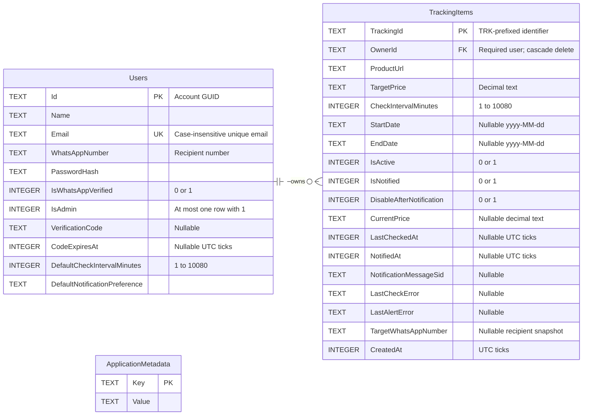

# SaleTracking database ERD and structure

This document describes the SQLite database currently used by SaleTracking, schema version **1**. It reflects the implemented tables and their relationships.

- **Database file:** `.local/saletracking.db` (default, relative to the workspace).
- **Schema source:** [001_Initial.sql](SaleTracking/Database/Migrations/001_Initial.sql).
- **Setup and backups:** [DATABASE_SETUP.md](DATABASE_SETUP.md).
- **Editable diagram:** [DATABASE_ERD.mmd](DATABASE_ERD.mmd).

## Entity relationship diagram



**PK** = primary key, **FK** = foreign key, **UK** = unique key. One user can own zero or many trackers; every tracker must have exactly one user. The dashed line denotes a non-identifying relationship: `OwnerId` is not part of the tracker's primary key. `ApplicationMetadata` is independent and has no foreign keys.

## Table structure

The types and defaults below are the actual SQLite declarations. **Required** means `NOT NULL`; it does not itself reject empty strings. A dash in the default column means there is no explicit SQL default. Optional columns can contain `NULL`.

### Users — 11 columns

Stores customer and installation administrator accounts, login credentials, verification state, and preferences. `IsAdmin` distinguishes the administrator from customers.

| Column | SQLite type | Required | SQL default | Key / purpose |
| --- | --- | --- | --- | --- |
| `Id` | `TEXT` | Yes | — | PK; app-generated GUID, stored with hyphens |
| `Name` | `TEXT` | Yes | — | Display name |
| `Email` | `TEXT` | Yes | — | Unique with `COLLATE NOCASE`; app trims and lowercases it |
| `WhatsAppNumber` | `TEXT` | Yes | `''` | Account's recipient number |
| `PasswordHash` | `TEXT` | Yes | — | Password hash used for login |
| `IsWhatsAppVerified` | `INTEGER` | Yes | `0` | Verification flag; SQL permits only `0` or `1` |
| `IsAdmin` | `INTEGER` | Yes | `0` | Role flag; SQL permits only `0` or `1`; partial unique index allows at most one admin |
| `VerificationCode` | `TEXT` | No | — | Pending verification code; cleared after successful verification |
| `CodeExpiresAt` | `INTEGER` | No | — | Verification expiry in .NET UTC ticks; cleared after successful verification |
| `DefaultCheckIntervalMinutes` | `INTEGER` | Yes | `1` | Default interval; SQL range is `1`–`10080` minutes |
| `DefaultNotificationPreference` | `TEXT` | Yes | `'WhatsApp'` | App preference values: `WhatsApp`, `Email`, `Both`; SQL does not restrict values to this list |

### TrackingItems — 18 columns

Stores each product tracker, its schedule, latest price/check result, and alert state.

| Column | SQLite type | Required | SQL default | Key / purpose |
| --- | --- | --- | --- | --- |
| `TrackingId` | `TEXT` | Yes | — | PK; app generates `TRK-` followed by 32 uppercase GUID hexadecimal characters |
| `OwnerId` | `TEXT` | Yes | — | FK to `Users.Id`, with `ON DELETE CASCADE` |
| `ProductUrl` | `TEXT` | Yes | — | URL checked for the product's price |
| `TargetPrice` | `TEXT` | Yes | — | Alert threshold, stored as invariant decimal text |
| `CheckIntervalMinutes` | `INTEGER` | Yes | — | SQL range is `1`–`10080` minutes |
| `StartDate` | `TEXT` | No | — | Optional schedule start, `yyyy-MM-dd` |
| `EndDate` | `TEXT` | No | — | Optional schedule end, `yyyy-MM-dd` |
| `IsActive` | `INTEGER` | Yes | `1` | Monitoring flag; SQL permits only `0` or `1` |
| `IsNotified` | `INTEGER` | Yes | `0` | Alert submission recorded; SQL permits only `0` or `1` |
| `DisableAfterNotification` | `INTEGER` | Yes | `0` | Whether successful alert submission disables monitoring; SQL permits only `0` or `1` |
| `CurrentPrice` | `TEXT` | No | — | Latest recorded price, stored as invariant decimal text |
| `LastCheckedAt` | `INTEGER` | No | — | Most recent check time in .NET UTC ticks |
| `NotifiedAt` | `INTEGER` | No | — | Recorded alert submission time in .NET UTC ticks |
| `NotificationMessageSid` | `TEXT` | No | — | Message identifier returned by the notification service |
| `LastCheckError` | `TEXT` | No | — | Error from the latest price check, if any |
| `LastAlertError` | `TEXT` | No | — | Most recent alert error; cleared on successful submission |
| `TargetWhatsAppNumber` | `TEXT` | No | — | Recipient number captured when the tracker is created |
| `CreatedAt` | `INTEGER` | Yes | — | Creation time in .NET UTC ticks, supplied by the app |

### ApplicationMetadata — 2 columns

Stores application migration markers, independently of user and tracker records.

| Column | SQLite type | Required | SQL default | Key / purpose |
| --- | --- | --- | --- | --- |
| `Key` | `TEXT` | Yes | — | PK; unique metadata name |
| `Value` | `TEXT` | Yes | — | Stored metadata value |

The current key `legacy-admin-import` records one of `imported`, `not-found`, or `existing-admin-kept`. This prevents the former admin JSON file from being imported again. Schema version **1** is recorded separately in SQLite's `PRAGMA user_version`.

## Relationships, constraints, and indexes

| Definition | Behavior |
| --- | --- |
| `TrackingItems.OwnerId → Users.Id` | Required owner; deleting a user cascades to that user's trackers. There is currently no account-delete UI. |
| `Users.Id`, `TrackingItems.TrackingId`, `ApplicationMetadata.Key` | Each is the primary key of its table. SQLite creates indexes for these text primary keys. |
| `Users.Email UNIQUE COLLATE NOCASE` | SQLite enforces case-insensitive uniqueness through an automatically created unique index. |
| `IX_Users_InstallationAdmin` | Unique index on `Users(IsAdmin) WHERE IsAdmin = 1`; permits many customers and at most one installation administrator. |
| `IX_TrackingItems_OwnerCreated` | Index on `(OwnerId, CreatedAt DESC)` for listing a user's trackers by creation time. |
| `IX_TrackingItems_ActiveSchedule` | Index on `(IsActive, EndDate, StartDate)` for filtering active schedules. |
| Boolean `CHECK` constraints | Restrict the five flag columns across `Users` and `TrackingItems` to `0` or `1`. |
| Interval `CHECK` constraints | Restrict both interval columns to `1`–`10080` minutes, inclusive. |

Foreign keys are enabled on application connections. The tables use ordinary SQLite typing, not `STRICT` tables. The schema does not contain SQL checks for GUID format, URL format, decimal format, positive prices, valid dates, or start/end ordering. Application validation and serialization handle those concerns where implemented.

## Storage formats and application behavior

- **Prices:** `TargetPrice` and `CurrentPrice` store invariant decimal strings, such as `1499.50`. The app reads them as C# `decimal`. This preserves decimal precision; SQL text ordering is not numeric ordering.
- **Dates:** `StartDate` and `EndDate` use ISO `yyyy-MM-dd` strings. The scheduler compares them against the current UTC date.
- **Timestamps:** `CodeExpiresAt`, `LastCheckedAt`, `NotifiedAt`, and `CreatedAt` use .NET UTC ticks: 100-nanosecond units since `0001-01-01T00:00:00Z`. They are not Unix timestamps.
- **Ownership:** `OwnerEmail` on the C# tracker model is loaded by joining `TrackingItems.OwnerId` to `Users.Id`. It is not a column in `TrackingItems`, so changing an email preserves ownership.
- **Displayed status:** `TrackingItem.Status` is computed from `IsNotified` and `IsActive`; it is not stored as a separate column.
- **Latest state:** Price checks update the existing tracker row. Successful alert submission records its time and message ID, sets `IsNotified`, and optionally disables monitoring. The schema does not contain historical price or notification-event tables.
- **WhatsApp connection:** The bridge keeps linked-device session credentials, browser state, and its message receipt journal under `.local/whatsapp`. SQLite stores account recipient numbers and tracker alert state. There is no QR-code or sender-session table.

## Implementation map

```text
SaleTracking/
├── Database/
│   └── Migrations/
│       └── 001_Initial.sql       Table, constraint, and index definitions
├── Services/
│   ├── SqliteDatabase.cs        Connections, schema initialization, legacy import
│   ├── SqliteAccountStore.cs    User/admin accounts and preferences
│   └── SqliteTrackingStore.cs   Trackers, schedules, prices, and alert state
└── appsettings.json            Database:Path configuration

.local/
├── saletracking.db             SQLite database, schema version 1
└── whatsapp/                   Bridge-managed files, outside SQLite
```

The application resolves `Database:Path` relative to its ASP.NET content root. The default is `../.local/saletracking.db`. Startup creates the database if needed, applies the embedded migration transactionally, and uses WAL journaling. See the setup guide for deployment and backup instructions.
